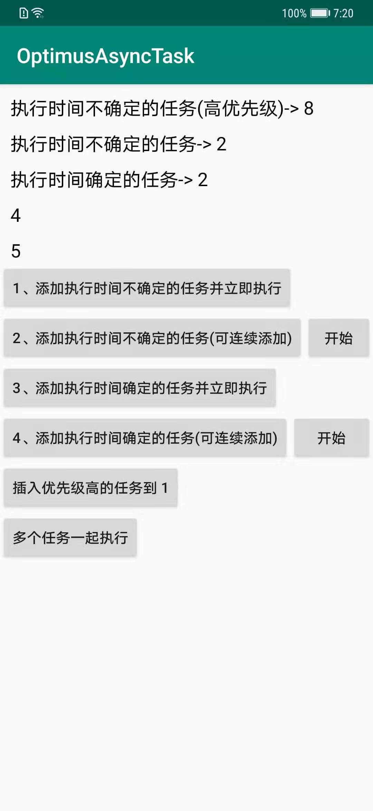
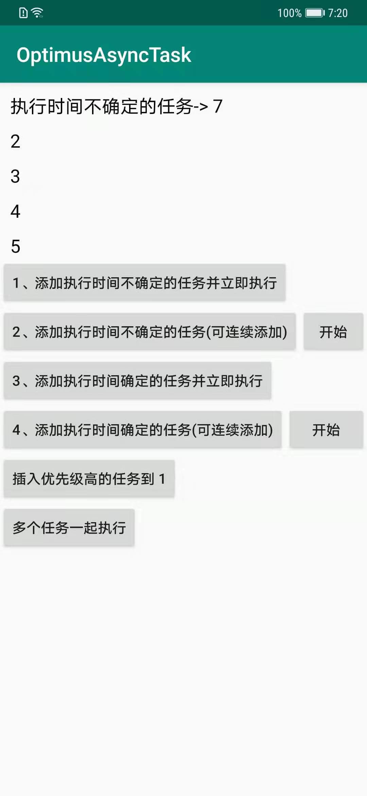

# OptimusAsyncTask
基于 kotlin Channel 的优先级异步任务队列

适合于排队执行的任务实现，比如直播间动画排队播放。

# 导入
```gradle
allprojects {
  repositories {
   ...
   maven { url 'https://jitpack.io' }
  }
}

dependencies {
    implementation 'com.github.EspoirX:OptimusAsyncTask:v1.5'
}
```
[](https://jitpack.io/#EspoirX/OptimusAsyncTask)


# 特点：
1. 基于 kotlin Channel 实现
2. 可设置优先级
3. 使用简单

<a href="art/WechatIMG3.jpeg"></a>
<a href="art/WechatIMG4.jpeg"></a>

# 介绍
OptimusAsyncTask 将每个任务抽象成 OptimusTask，OptimusTask 可以设置任务执行时间，任务优先级，获取任务状态等。
同时 OptimusAsyncTask 提供了 OptimusTask 的默认实现类 BaseOptimusTask，它实现了 Comparable 接口，任务按照优先级排序。

**优先级 TaskPriority**
 优先级的标准如下：
 TaskPriority.LOW < TaskPriority.DEFAULT < TaskPriority.HIGH
 当优先级相同 按照插入次序排队
 默认优先级是 TaskPriority.DEFAULT

**任务**
任务种类可分为 2 种，分别是 执行时间不确定 的任务和 执行时间确定 的任务。执行时间不确定的任务在任务执行完后需要调用
 doNextTask() 方法执行下一个任务，否则会一直挂起。
执行时间确定的任务需要重写 getDuration() 方法返回具体的执行时间，单位是毫秒，执行时间到了会自动执行下一个任务。

# 使用方法

1. 创建执行时间不确定的任务
```kotlin
private class Task1(var textView: TextView) : OptimusTask() {

    @SuppressLint("SetTextI18n")
    override fun doTask() {
        textView.text = "执行时间不确定的任务-> " + getSequence()

        //模拟该任务耗时两秒
        textView.postDelayed({
            doNextTask() //执行下一个
        }, 2000)
    }

    override fun finishTask() {
        Log.i("Task1", "finishTask-> " + getSequence())
    }
}
```
2. 创建执行时间确定的任务
```kotlin
private class Task2(var textView: TextView) : OptimusTask() {

    @SuppressLint("SetTextI18n")
    override fun doTask() {
        textView.text = "执行时间确定的任务-> " + getSequence()
    }

    //确定该任务耗时时间
    override fun getDuration(): Long {
        return 2000
    }

    override fun finishTask() {
        Log.i("Task1", "finishTask-> " + getSequence())
    }
}
```

3. 通过任务管理器 OptimusTaskManager 开始执行任务

一个 OptimusTaskManager 管理着一个任务队列。

```kotlin
val taskManager1 = OptimusTaskManager()

val taskManager2 = OptimusTaskManager()
```


更多例子请查看 demo。
